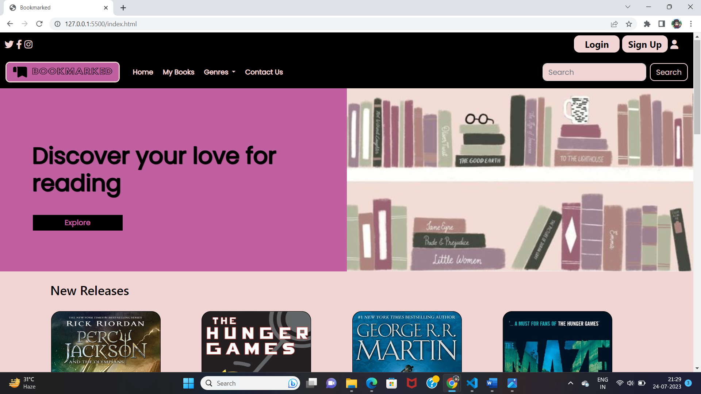
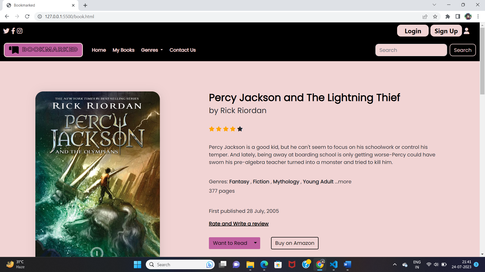
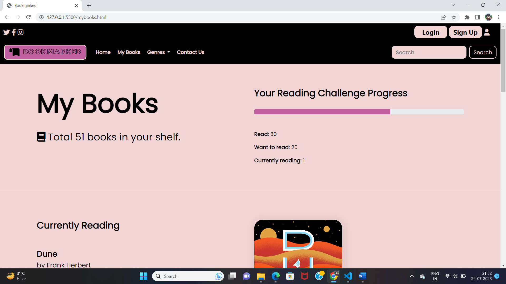
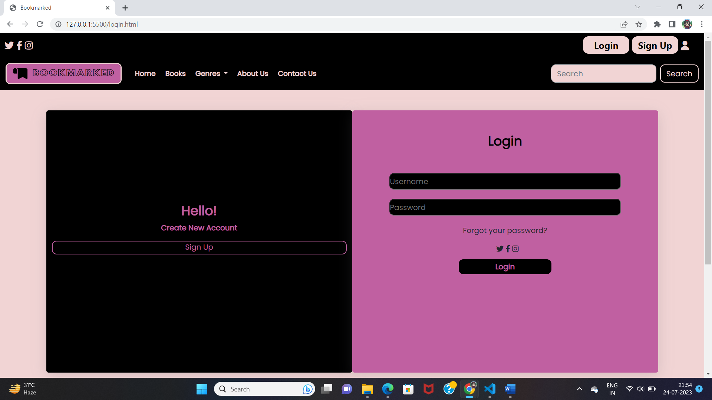

# Book Review Website   

A simple Book Review Website built using **HTML**, **CSS**, and **Bootstrap**. This frontend project is for showcasing book collections and providing a platform for static reviews and ratings.  

---  

## Features  

- **Responsive Design**: Built with Bootstrap, ensuring a seamless experience across all devices.  
- **Book Listings**: Display a curated collection of books with titles, authors, and ratings.  
- **Static Review Section**: Each book has a section for reviews and ratings.  
- **Modern UI**: Styled with CSS and Bootstrap for a polished and professional look.    

---  

## Technologies Used   

- **HTML**: For structuring the content.  
- **CSS**: For custom styling.  
- **Bootstrap**: For layout and responsiveness.

## Screenshots 

### Homepage
  

---

### Book Details
  

---

### User's Book Details

---

### Login/Sign Up Page

